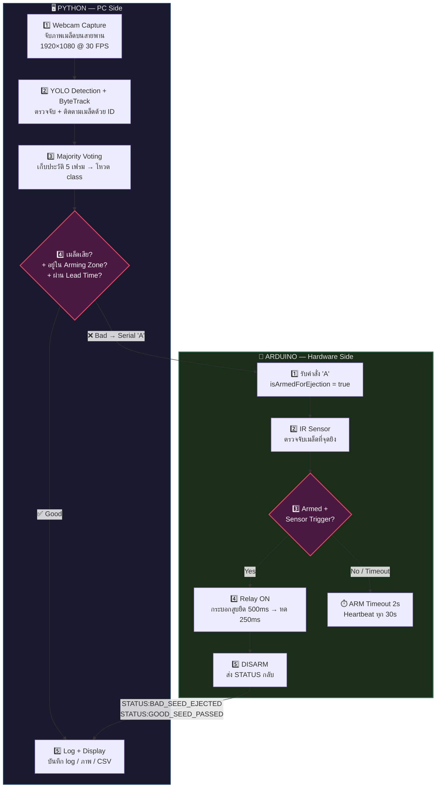
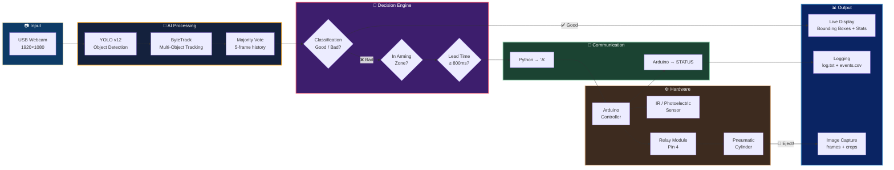

# ☕ Automated Coffee Bean Sorting System (YOLO + Arduino + Pneumatic)

โปรเจกต์นี้เป็นระบบคัดแยกเมล็ดกาแฟอัตโนมัติ
ใช้โมเดล YOLO ตรวจจับและจำแนกเมล็ดดี/เมล็ดเสียแบบเรียลไทม์
แล้วส่งคำสั่งไปยัง Arduino เพื่อสั่งงานกระบอกสูบลม (Pneumatic Cylinder)
ให้ดีดเมล็ดเสียออกจากสายพาน

> โปรเจกต์นี้พัฒนาสำหรับใช้เป็นโครงงานวิศวกรรม และใช้เป็นตัวอย่างผลงาน (Portfolio) ด้าน Machine Learning + Embedded System


## 📑 Table of Contents

- [Features](#features)
- [System Overview](#system-overview)
- [System Architecture](#system-architecture)
- [Communication Protocol](#communication-protocol-python--arduino)
- [Project Structure](#project-structure)
- [Prerequisites](#prerequisites)
- [Runtime Controls](#-runtime-controls)
- [Logging & Data Capture](#-logging--data-capture)
- [Troubleshooting](#-troubleshooting)
- [Author](#author)

---

## Features

- ใช้ **YOLO** (Ultralytics) + **ByteTrack** สำหรับตรวจจับและติดตามเมล็ดกาแฟแบบเรียลไทม์
- จำแนกเมล็ดกาแฟ **15 คลาส** แยกเป็นเมล็ดดีและเมล็ดเสีย:

  | ประเภท | คลาส |
  |---|---|
  | ✅ **GOOD** | `A`, `AA`, `AAA`, `B`, `Dry`, `Honey`, `Pea berry`, `Wash` |
  | ❌ **BAD** | `Black`, `Chipped`, `Elephant ear`, `Faded`, `Split`, `Triangle`, `Weevil-infested` |

- กลไก **Frame Stability + Majority Voting**:
  - ต้องเห็นวัตถุอย่างน้อย 5 เฟรม (`FRAMES_TO_CONFIRM_STABILITY`) จึงจะเชื่อว่าตรวจจับถูกต้อง
  - ใช้ประวัติ class 5 ค่า (`CLASS_VOTING_HISTORY`) แล้วโหวต majority เพื่อยืนยันผลลัพธ์
- ระบบ **Arming Zone + Lead Time**:
  - กำหนดโซน X บนภาพเป็นจุด "เตรียมยิง" (25%–75% ของความกว้างภาพ)
  - มีเวลาเตรียม (`LEAD_TIME_MS = 800ms`) ก่อนที่เมล็ดจะถึงจุดยิงจริง
- เชื่อมต่อกับ **Arduino** ผ่าน Serial Communication:
  - Python ส่งคำสั่ง `'A'` → Arduino ARM → เซ็นเซอร์ตรวจจับ → กระบอกสูบยิง → ส่ง status กลับ
- **ระบบ Logging ครบวงจร**:
  - บันทึก log ข้อความลงไฟล์ `arduino_log.txt` + แสดง overlay บนหน้าจอ
  - บันทึก event ลง `events.csv` (confirm, eject, cleanup, duplicate, etc.)
  - เซฟภาพเฟรม + ครอปเมล็ดตอน confirm / eject แยกตามคลาส
- **Duplicate Suppression** — ป้องกันนับเมล็ดเดียวกันซ้ำหลาย ID

---

## System Overview



---

## System Architecture



---

## Communication Protocol (Python ↔ Arduino)

### Python → Arduino

| Command | Byte | Description |
|---|---|---|
| **ARM** | `'A'` | สั่งเตรียมยิงเมล็ดเสีย (Arm for ejection) |

### Arduino → Python

| Message | Trigger | Description |
|---|---|---|
| `Enhanced Coffee Sorter - Arduino Ready` | Startup | ข้อความเริ่มต้นระบบ |
| `System ARMED. Waiting for sensor trigger...` | รับ 'A' | ระบบพร้อมยิง |
| `STATUS:BAD_SEED_EJECTED` | หลังยิง | ดีดเมล็ดเสียเรียบร้อย |
| `STATUS:GOOD_SEED_PASSED` | เมล็ดดีผ่าน | เมล็ดดีผ่านไปแล้ว |
| `WARNING: ARM timeout` | หมดเวลา 2s | ARM timeout → disarm อัตโนมัติ |
| `Heartbeat - Armed: ... \| Ready: ...` | ทุก 30 วินาที | สถานะระบบเป็นระยะ |

---

## Project Structure

```
Coffee-Bean-Sorting-System/
├── src/
│   ├── Coffee-Bean-Classification-System.py   # โค้ดหลัก: YOLO + Webcam + Tracking + Serial
│   └── requirements.txt                       # Python dependencies
├── arduino/
│   └── coffee_sorter_controller/
│       └── coffee_sorter_controller.ino        # โค้ด Arduino: ควบคุมรีเลย์ + เซ็นเซอร์ + กระบอกสูบ
├── docs/                                       # รูปเครื่อง, diagram, เอกสารเพิ่มเติม
├── .gitignore
└── README.md
```

### Auto-generated directories (runtime)

```
├── logs/
│   └── <YYYY-MM-DD_HH-MM-SS>/
│       ├── arduino_log.txt        # Combined Arduino + system log
│       └── events.csv             # Structured event log (confirm, eject, cleanup)
└── captures/
    └── <YYYY-MM-DD_HH-MM-SS>/
        ├── frames/                # Periodic full-frame snapshots
        └── crops/
            ├── confirmed/<class>/ # ครอปเมล็ดตอนยืนยัน class
            └── ejected/<class>/   # ครอปเมล็ดตอนสั่งดีด
```

---

## Prerequisites

### Hardware

| Component | Description |
|---|---|
| 📷 **USB Webcam** | กล้อง USB (แนะนำ 1920×1080, 30 FPS) |
| 🔧 **Arduino** | Arduino Uno / Mega / Nano ต่อผ่าน USB |
| 💨 **Pneumatic Cylinder** | กระบอกสูบลม + วาล์วโซลินอยด์ |
| 🔌 **Relay Module** | โมดูลรีเลย์ควบคุมวาล์ว (Pin 4) |
| 🔍 **IR/Photoelectric Sensor** | เซ็นเซอร์ตรวจจับเมล็ดที่จุดยิง (Pin 7) |
| 🏭 **Conveyor Belt** | สายพานลำเลียงเมล็ดกาแฟ |

### Software

| Dependency | Version | Purpose |
|---|---|---|
| Python | ≥ 3.8 | Runtime |
| `ultralytics` | ≥ 8.0 | YOLO inference + ByteTrack tracking |
| `opencv-python` | ≥ 4.5 | Video capture, display, image I/O |
| `pyserial` | ≥ 3.5 | Serial communication with Arduino |
| Arduino IDE | ≥ 2.0 | Upload firmware to Arduino |

---

## 🛠️ Getting Started

### 1. Clone โปรเจกต์

```bash
git clone https://github.com/salmonsalmonboi/Coffee-Bean-Sorting-System.git
cd Coffee-Bean-Sorting-System
```

### 2. ติดตั้ง Python Dependencies

```bash
pip install opencv-python ultralytics pyserial
```

หรือติดตั้งจาก `requirements.txt`:
```bash
pip install -r src/requirements.txt
```

### 3. Upload Arduino Firmware

1. เปิดไฟล์ `arduino/coffee_sorter_controller/coffee_sorter_controller.ino` ใน Arduino IDE
2. เลือก Board (Arduino Uno) และ Port ที่ถูกต้อง
3. กด **Upload**
4. เปิด Serial Monitor เพื่อตรวจสอบข้อความ `"Enhanced Coffee Sorter - Arduino Ready"`

### 4. เชื่อมต่อ Hardware

```
Arduino Pin 4 ──→ Relay Module ──→ Pneumatic Valve ──→ Cylinder
Arduino Pin 7 ──→ IR/Photoelectric Sensor (INPUT_PULLUP)
Arduino USB   ──→ PC (COM Port)
USB Webcam    ──→ PC
```

### 5. แก้ไข Configuration

เปิดไฟล์ `src/Coffee-Bean-Classification-System.py` แล้วแก้:

```python
SERIAL_PORT = 'COM5'                    # ← เปลี่ยนเป็น COM Port ของ Arduino
CAMERA_INDEX = 0                        # ← ลำดับกล้อง (0 = default)
YOLO_MODEL_PATH = 'path/to/best.pt'     # ← Path ของไฟล์โมเดล YOLO (.pt)
```

### 6. รันระบบ

```bash
python src/Coffee-Bean-Classification-System.py
```

---

## ⚙️ Configuration Guide

### Core Settings

| Parameter | Default | Description |
|---|---|---|
| `DEBUG_MODE` | `True` | แสดง debug messages บน console |
| `SERIAL_PORT` | `'COM5'` | COM Port ของ Arduino (**ต้องเปลี่ยนให้ตรง**) |
| `BAUD_RATE` | `9600` | ต้องตรงกับ `Serial.begin()` ของ Arduino |
| `CAMERA_INDEX` | `0` | ลำดับกล้อง (0 = กล้องตัวแรก) |
| `YOLO_MODEL_PATH` | `'...'` | **Path สัมบูรณ์** ของไฟล์โมเดล `.pt` |

### Camera

| Parameter | Default | Description |
|---|---|---|
| `CAMERA_WIDTH` | `1920` | ความกว้างภาพ (pixels) |
| `CAMERA_HEIGHT` | `1080` | ความสูงภาพ (pixels) |
| `CAMERA_FPS` | `30` | Frame rate |

### Detection & Tracking

| Parameter | Default | Description |
|---|---|---|
| `CONFIDENCE_THRESHOLD` | `0.5` | ความมั่นใจขั้นต่ำในการตรวจจับ (50%) |
| `FRAMES_TO_CONFIRM_STABILITY` | `5` | จำนวนเฟรมขั้นต่ำก่อนยืนยัน class |
| `CLASS_VOTING_HISTORY` | `5` | จำนวนค่า class ที่เก็บไว้โหวต |
| `OBJECT_TIMEOUT_MS` | `5000` | ลบ object ที่หายไปเกิน 5 วินาที |

### Ejection Control

| Parameter | Default | Description |
|---|---|---|
| `ARMING_ZONE_START_X_RATIO` | `0.25` | ขอบซ้ายของโซนดีด (25% ของภาพ) |
| `ARMING_ZONE_END_X_RATIO` | `0.75` | ขอบขวาของโซนดีด (75% ของภาพ) |
| `LEAD_TIME_MS` | `800` | เวลารอ (ms) หลังตรวจจับก่อนอนุญาตให้ดีด |
| `COMMAND_COOLDOWN_MS` | `300` | ระยะเวลาขั้นต่ำ (ms) ระหว่างคำสั่งดีดแต่ละครั้ง |

### Data Capture

| Parameter | Default | Description |
|---|---|---|
| `SAVE_FRAMES` | `True` | บันทึกเฟรมเต็มเป็นระยะ |
| `FRAME_SAVE_EVERY_N` | `1` | บันทึกทุก N เฟรม (1 = ทุกเฟรม) |
| `SAVE_CROPS_ON_CONFIRM` | `True` | เซฟรูปครอปเมื่อยืนยัน class |
| `SAVE_CROPS_ON_EJECT` | `True` | เซฟรูปครอปเมื่อสั่งดีด |
| `CROP_PADDING` | `8` | ขอบเผื่อรอบครอป (pixels) |

### Arduino Hardware (`.ino`)

| Parameter | Default | Description |
|---|---|---|
| `CYLINDER_RELAY_PIN` | `4` | พินรีเลย์ควบคุมกระบอกสูบ |
| `SEED_SENSOR_PIN` | `7` | พินเซ็นเซอร์ตรวจจับเมล็ด |
| `SENSOR_DEBOUNCE_MS` | `30` | ป้องกันสัญญาณสั่น (debounce) |
| `CYLINDER_EXTEND_DURATION_MS` | `500` | เวลายืดกระบอกสูบ |
| `CYLINDER_RETRACT_DURATION_MS` | `250` | เวลาหดกระบอกสูบ |
| `ARM_TIMEOUT_MS` | `2000` | หมดเวลาอัตโนมัติหลัง ARM |

---

## 🎮 Runtime Controls

| Key | Action |
|---|---|
| `Q` | **ออกจากโปรแกรม** — ปิดระบบอย่างปลอดภัย (ปิด Serial, Camera) |
| `R` | **รีเซ็ตสถิติ** — ตั้งค่า Good/Bad/Ejected counts เป็น 0 |

### On-Screen Display

- **Bounding boxes** — กรอบล้อมรอบเมล็ดที่ตรวจจับได้ พร้อมชื่อ class
- **Arming Zone** — เส้นแนวตั้งสีเหลือง 2 เส้นแสดงโซนดีด
- **สถิติ** — `GOOD: X | BAD: Y | EJECTED: Z`
- **สถานะระบบ** — `READY` (พร้อมยิง) / `COOLDOWN` (รอ cooldown)
- **Log overlay** — แสดง 10 log ล่าสุดบนหน้าจอ

---

## 📋 Logging & Data Capture

### ไฟล์ Log

| ไฟล์ | รูปแบบ | เนื้อหา |
|---|---|---|
| `logs/<timestamp>/arduino_log.txt` | Text | Timestamped log ทั้ง Arduino feedback + system events |
| `logs/<timestamp>/events.csv` | CSV | Structured events: `startup`, `confirm`, `eject`, `duplicate`, `cleanup`, `stats_reset` |

### ภาพที่บันทึก

| ตำแหน่ง | เนื้อหา |
|---|---|
| `captures/<timestamp>/frames/` | Full annotated frames ทุก N เฟรม |
| `captures/<timestamp>/crops/confirmed/<class>/` | รูปครอปเมล็ดเมื่อยืนยัน class |
| `captures/<timestamp>/crops/ejected/<class>/` | รูปครอปเมล็ดเมื่อสั่งดีด |

> 💡 ทุกครั้งที่รัน จะสร้างโฟลเดอร์ใหม่ตาม timestamp จึงไม่เขียนทับรอบก่อนหน้า

---

## 🔧 Troubleshooting

| ปัญหา | สาเหตุ | วิธีแก้ |
|---|---|---|
| `Unable to open port COM5` | COM Port ผิด หรือ Serial Monitor เปิดอยู่ | ✅ ตรวจสอบ Device Manager, ปิด Serial Monitor ใน Arduino IDE |
| `Cannot open camera` | กล้องถูกใช้งานอยู่ หรือ index ผิด | ✅ ปิดแอปอื่นที่ใช้กล้อง, ลอง `CAMERA_INDEX = 1` |
| `Unable to load YOLO model` | Path โมเดลไม่ถูกต้อง | ✅ ตรวจสอบว่าไฟล์ `.pt` อยู่ที่ path ที่ระบุ |
| เมล็ดไม่ถูกตรวจจับ | Confidence ต่ำ / แสงไม่ดี | ✅ ลด `CONFIDENCE_THRESHOLD`, ปรับปรุงแสง |
| ดีดเร็ว/ช้าเกินไป | Lead time ไม่ตรงกับความเร็วสายพาน | ✅ ปรับ `LEAD_TIME_MS` ให้เหมาะสม |
| เห็น ID ซ้ำ (duplicate) | Tracker ไม่เข้มพอ | ✅ เพิ่ม `new_track_thresh` ใน `bytetrack.yaml` |
| `fuse_score` error | Config tracker ไม่ถูก | ✅ ตรวจสอบว่า `fuse_score: False` ใน YAML |
| เมล็ดเสียไม่ถูกดีด | ไม่อยู่ใน arming zone หรือ cooldown | ✅ ขยาย zone ratio, ลด `COMMAND_COOLDOWN_MS` |
| Arduino ARM timeout | เมล็ดไม่ผ่านเซ็นเซอร์ทันเวลา | ✅ เพิ่ม `ARM_TIMEOUT_MS` หรือปรับตำแหน่งเซ็นเซอร์ |

---

## Author

**A.** Chetsada Jinamoon, **B.** Supakorn Sirimueangmoon, **C.** Audsadakorn Jeerahut, **D.** Kwanchai Eurviriyanukul, **G.** Pranote Pookkapund

> Department of Computer Engineering, Faculty of Engineering, Rajamangala University of Technology Lanna Chiang Mai, Thailand

---

